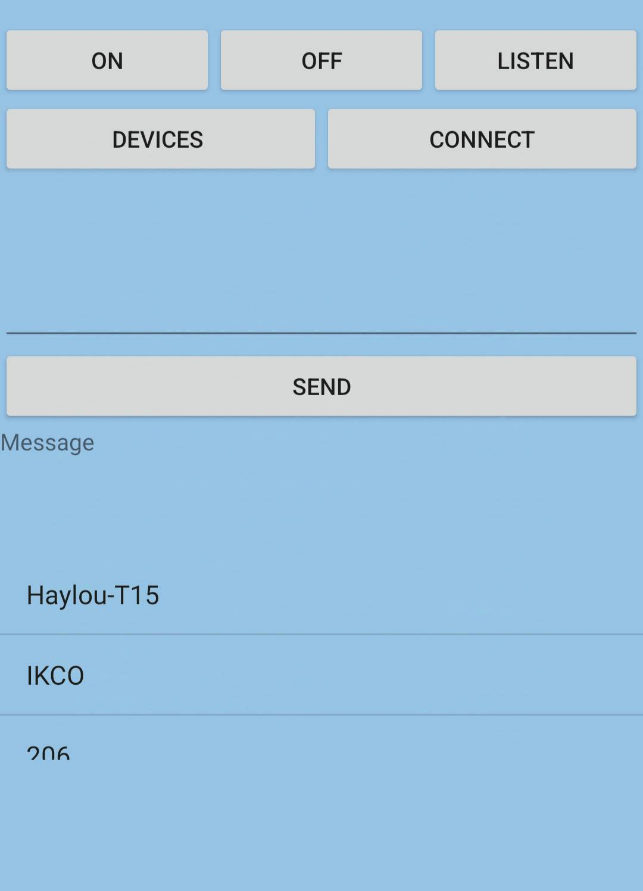

# Bluetooth Chat Application
Welcome to the Bluetooth Chat Application! 🚀

This project allows you to connect with others via Bluetooth and chat seamlessly, bringing people together in a fun and interactive way. Whether you're at a conference, in a café, or simply hanging out with friends, this app makes it easy to communicate without the need for an internet connection.
## Features
-Bluetooth Connectivity: Effortlessly connect with nearby devices to initiate chats.

-Real-Time Messaging: Enjoy instant messaging capabilities, ensuring that your conversations flow smoothly.

-User-Friendly Interface: The intuitive design makes it easy for anyone to start chatting in seconds.

-No Internet Required: Communicate freely without the need for Wi-Fi or mobile data.

## How It Works
1.Pairing Devices: Simply enable Bluetooth on your device and search for nearby devices to connect.

2.Start Chatting: Once connected, you can send and receive messages in real-time, making communication a breeze.

3.Disconnect: When you're finished, you can easily disconnect and reconnect with other devices as needed.
## Getting Started
To get started with the Bluetooth Chat Application:

1.Clone the repository to your local machine.

2.Follow the installation instructions to set up the application on your device.

3.Pair your device with others and start chatting!

## Contact
If you have any questions, suggestions, or feedback, please reach out! You can contact me via [Telegram](https://t.me/mrk7711) or email me at mrk77114@gmail.com.

